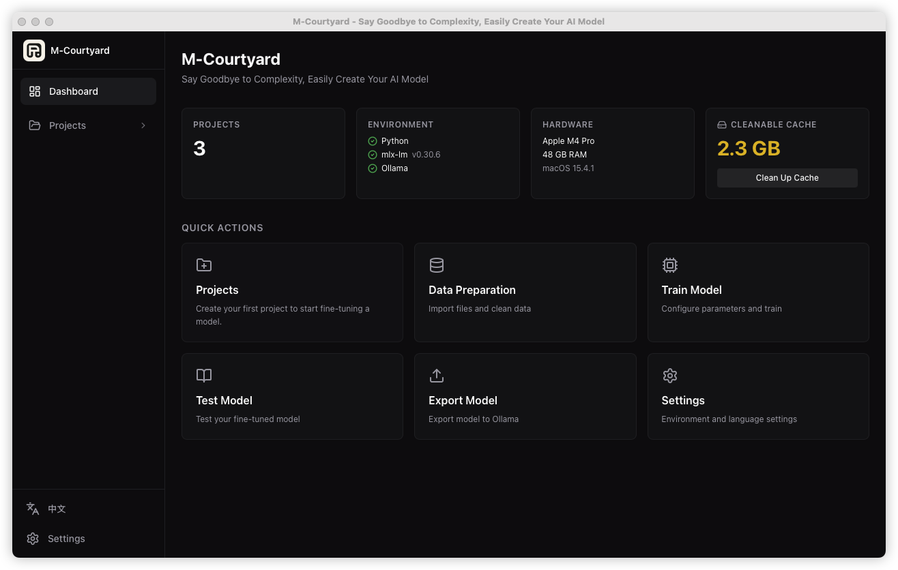
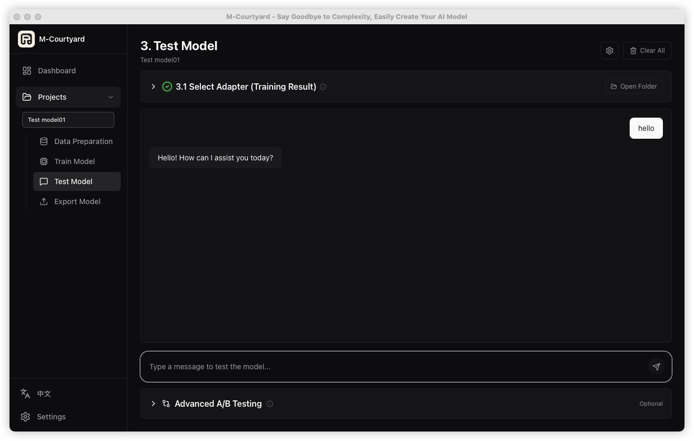

<div align="center">

<!-- TODO: Replace with actual banner image -->
<!--  -->

# 🏡 M-Courtyard

**Say Goodbye to Complexity, Easily Create Your AI Model**

*From raw documents to a deployable Ollama model — entirely on your Mac.*

[](https://github.com/Mcourtyard/m-courtyard/stargazers)
[](https://github.com/Mcourtyard/m-courtyard/releases)
[](https://github.com/Mcourtyard/m-courtyard/releases/latest)
[](LICENSE)
[](https://github.com/Mcourtyard/m-courtyard/commits/main)
[](https://discord.gg/v9ajdTSZzA)

English | **[中文](./README_zh-CN.md)**

</div>

---

## Why M-Courtyard?

Most fine-tuning tools are CLI-heavy, cloud-dependent, or require juggling multiple scripts. M-Courtyard wraps the **full pipeline** into a single, guided desktop experience — powered by [Ollama](https://ollama.com) + [mlx-lm](https://github.com/ml-explore/mlx-examples/tree/main/llms/mlx_lm):

| Step | What It Does |
|------|-------------|
| **1. Data Prep** | Import documents (txt/docx/pdf) → auto-clean → AI-generate training datasets (Q&A, style imitation, multi-turn dialogue, instruction) |
| **2. Train Model** | Pick a base model → select dataset → configure LoRA params → train with real-time loss chart & progress |
| **3. Test Model** | Chat with your fine-tuned adapter to verify quality |
| **4. Export Model** | One-click export to Ollama with quantization (Q4/Q8/F16) |

> **100% local. No cloud. No API keys. No data leaves your Mac.**

<div align="center">
  
  <p><em>Dashboard — Environment status, quick actions, and project overview</em></p>
</div>

<details>
<summary><strong>📸 More Screenshots (click to expand)</strong></summary>
<br/>

<div align="center">
  
  <p><em>Data Preparation — AI-powered dataset generation with real-time log</em></p>
</div>

<div align="center">
  
  <p><em>Training — Live loss curve and iteration progress</em></p>
</div>

<div align="center">
  
  <p><em>Training Summary — Duration, loss metrics, and 99.7% improvement</em></p>
</div>

<div align="center">
  
  <p><em>Test Model — Chat with your fine-tuned model</em></p>
</div>

<div align="center">
  
  <p><em>Export — One-click export to Ollama with quantization</em></p>
</div>

</details>

## Download

> **Most users should download the pre-built app below.** Building from source is only needed for development.

| Platform | Chip | Download |
|----------|------|----------|
| macOS 14+ | Apple Silicon (M1/M2/M3/M4) | [📦 Download .dmg](https://github.com/Mcourtyard/m-courtyard/releases/latest) |

> **⚠️ macOS Gatekeeper Notice**
> Since the app is not signed with an Apple Developer certificate, macOS may show a "damaged" warning. To fix this:
> 1. Install the app by dragging it to `/Applications` as usual
> 2. Open **Terminal** (Spotlight → type "Terminal")
> 3. Run the following command:
>    ```bash
>    sudo xattr -rd com.apple.quarantine /Applications/M-Courtyard.app
>    ```
> 4. Enter your **Mac login password** when prompted (the password won't be visible as you type — this is normal)
> 5. Done! Now open M-Courtyard from Applications and it will launch normally

<!-- TODO: Add more platforms when available -->

## What's New — v0.4.6

**PDF & DOCX Support is here** — Drop in your PDFs and Word documents and M-Courtyard will handle the rest. No manual conversion required.

- **Direct PDF/DOCX import** — Use `.pdf` and `.docx` files as training sources; text is automatically extracted before cleaning and generation
- **Zero-config setup** — Required Python libraries (`PyPDF2`, `python-docx`) are silently auto-installed on first use — no `pip install` needed
- **Smart prompt language matching** — Generation scripts now detect whether your source content is Chinese, English, Japanese, etc. and use the right prompt language automatically, so you won't see language-mismatch errors anymore
- **Data preview panel fix** — The log panel no longer collapses mid-generation; it stays open from the moment you click "Start Generation"

[View full changelog →](CHANGELOG.md)

---

## Key Features

### Data Processing & Generation
- **Batch multi-file import** — Drag-and-drop multiple files at once; queue-based generation with per-file progress
- **AI dataset generation** — Use a local LLM to transform documents into high-quality training data
- **Multiple generation types** — Knowledge Q&A / Style Imitation / Multi-turn Dialogue / Instruction Training
- **Rule-based generation** — Generate basic training data without any AI model
- **Incremental save & crash recovery** — Every generated sample is saved immediately; resume after interruption

### Model Training
- **Training queue** — Queue multiple experiments; run them back-to-back without manual intervention
- **mlx-lm LoRA training** — Leverages Apple MLX unified memory for efficient fine-tuning on Apple Silicon
- **Live training visualization** — Real-time loss curves, iteration progress bar, and streaming logs
- **Multi-source model hub** — Auto-detect Ollama models, scan local HuggingFace/ModelScope caches, or download online
- **Configurable download source** — Switch between HuggingFace / HF Mirror (China acceleration) / ModelScope in Settings
- **Training presets** — Quick / Standard / Thorough configurations for different needs

### Export & Deployment
- **One-click Ollama export** — Export fine-tuned models directly to Ollama with Q4/Q8/F16 quantization
- **Universal model support** — Qwen, DeepSeek, GLM, Llama, GPT-OSS, Kimi, Mistral, Phi and more
- **Adapter management** — Manage and test multiple fine-tuned adapters

### User Experience
- **Guided 4-step workflow** — Unified progress bar + sub-step timeline across all pages
- **macOS notifications** — System notification on pipeline completion
- **100% local & private** — All data stays on your machine, no cloud dependency
- **Sleep prevention** — Automatically prevents macOS sleep during long-running tasks
- **i18n** — English and Chinese UI, switchable in Settings

## Requirements

| Item | Requirement |
|------|------------|
| OS | macOS 14+ (Sonoma or later) |
| Chip | Apple Silicon (M1 / M2 / M3 / M4 series) |
| RAM | 16 GB+ recommended for 7B models; 8 GB works for 3B |
| Dependencies | [Ollama](https://ollama.com) (for AI generation) · uv (Python env, auto-detected) |

## Quick Start

### Option 1: Download Release (Recommended)

1. Go to [**Releases**](https://github.com/Mcourtyard/m-courtyard/releases/latest) and download the latest `.dmg`
2. Open the `.dmg` file and drag **M-Courtyard.app** to your Applications folder
3. Launch M-Courtyard — done!

### Option 2: Build from Source

<details>
<summary>Click to expand build instructions</summary>

**Prerequisites:**

| Tool | Installation |
|------|-------------|
| Node.js 18+ | [nodejs.org](https://nodejs.org) or `brew install node` |
| pnpm | `npm install -g pnpm` |
| Rust toolchain | `curl --proto '=https' --tlsv1.2 -sSf https://sh.rustup.rs \| sh` |
| Xcode CLT | `xcode-select --install` |
| Ollama | [ollama.com](https://ollama.com) |

**Step-by-step:**

```bash
# 1. Clone the repo
git clone https://github.com/Mcourtyard/m-courtyard.git
cd m-courtyard/app

# 2. Make sure Rust is in PATH (needed after first install)
source "$HOME/.cargo/env"

# 3. Install frontend dependencies
pnpm install

# 4a. Development mode (hot-reload, fast iteration)
pnpm tauri dev

# 4b. OR: Production build (generates .app / .dmg)
pnpm tauri build
```

**After building:**

| Output | Location |
|--------|----------|
| `.app` bundle | `src-tauri/target/release/bundle/macos/M-Courtyard.app` |
| `.dmg` installer | `src-tauri/target/release/bundle/dmg/M-Courtyard_<version>_aarch64.dmg` |

> **Note:** In `pnpm tauri dev` mode, the macOS Dock icon shows the default Tauri icon. The custom app icon only appears in production builds (`pnpm tauri build`).

</details>

## Tech Stack

| Layer | Technology |
|-------|-----------|
| Frontend | React 19 + TypeScript + TailwindCSS v4 + Vite |
| Desktop | Tauri 2.x (Rust) |
| State | Zustand |
| AI Inference | Ollama (local HTTP API) |
| Training | mlx-lm (Apple MLX Framework, LoRA) |
| Python Env | uv + venv (auto-managed) |
| Storage | SQLite + local filesystem |
| i18n | English & Chinese |

## Project Structure

```
m-courtyard/
├── app/
│   ├── src/                      # React frontend
│   │   ├── pages/                # Page components (DataPrep, Training, Testing, Export)
│   │   ├── components/           # Shared components (StepProgress, ModelSelector, etc.)
│   │   ├── stores/               # Zustand state management
│   │   ├── services/             # Service layer (project, training)
│   │   └── i18n/                 # Internationalization (en / zh-CN)
│   ├── src-tauri/                # Rust backend
│   │   ├── src/commands/         # Tauri IPC commands
│   │   ├── src/python/           # Python subprocess management
│   │   ├── scripts/              # Python scripts (clean, generate, export, inference)
│   │   └── icons/                # App icons
│   └── package.json
├── LICENSE                       # AGPL-3.0 License
├── README.md                     # This file
└── README_zh-CN.md               # 中文文档
```

## Workflow Details

### 1. Data Preparation
- **1.1** Import raw files (txt, docx, pdf)
- **1.2** Auto-clean data (denoising, encoding fix, smart segmentation)
- **1.3** Choose generation method (AI via Ollama / built-in rules)
- **1.4** Choose generation type (Knowledge Q&A / Style Imitation / Multi-turn Dialogue / Instruction Training)
- **1.5** Review generated datasets

### 2. Train Model
- **2.1** Select base model (Ollama / local / HuggingFace online)
- **2.2** Select training dataset
- **2.3** Configure LoRA parameters (presets: Quick / Standard / Thorough)
- **2.4** Train with live loss chart & progress tracking

### 3. Test Model
- **3.1** Select fine-tuned adapter
- **3.2** Chat with the model to verify quality

### 4. Export Model
- **4.1** Select adapter
- **4.2** Set model name
- **4.3** Choose quantization (Q4 / Q8 / F16) → export to Ollama

## License

This project is licensed under the [GNU Affero General Public License v3.0](LICENSE).

If you wish to use M-Courtyard under different terms (e.g., commercial license), please contact: **tuwenbo0112@gmail.com**

## Contributing

Contributions are welcome! Here's how to get started:

1. **Fork** this repository
2. Create a feature branch: `git checkout -b feat/your-feature`
3. Commit your changes using [Conventional Commits](https://www.conventionalcommits.org/): `git commit -m "feat: add new feature"`
4. Push to your fork: `git push origin feat/your-feature`
5. Open a **Pull Request** against the `main` branch

Please make sure to:
- Write commit messages in **English**
- Follow the existing code style
- Add tests for new features when applicable

## Community

- [Discord](https://discord.gg/v9ajdTSZzA) — Chat, get help, share your fine-tuned models
- [GitHub Discussions](https://github.com/Mcourtyard/m-courtyard/discussions) — Feature ideas, Q&A, announcements
- [GitHub Issues](https://github.com/Mcourtyard/m-courtyard/issues) — Bug reports and feature requests

## Support

If you find M-Courtyard useful:
- Give it a ⭐ on GitHub — it helps more people discover the project!

## Star History

[](https://star-history.com/#Mcourtyard/m-courtyard&Date)

<div align="center">
  
  
  # M-Courtyard

  **Zero-code local LLM fine-tuning & data prep on Apple Silicon. Privacy-first, powered by MLX.**

  [](https://www.apple.com/macos)
  [](#)
  [](https://opensource.org/licenses/AGPL-3.0)
  [](https://discord.gg/v9ajdTSZzA)
  [](https://github.com/Mcourtyard/m-courtyard/releases/latest)

  [English](README.md) | [简体中文](README_zh-CN.md)

</div>

---

<!-- TODO: GIF 压缩与录制建议
  建议使用工具（如 CleanShot X, Kap，或免费的 Gifski）录制一个 5~10 秒的快速展示（包括拖入文件->点击生成->开始训练）。
  录制后如文件过大，可以使用 https://ezgif.com 压缩，尽量保持在 5MB 以下。
  上传后，将下面的图片链接替换为你的 GIF 链接。
-->
<div align="center">
  
  <br>
  <em>(TODO: Replace the static image above with an engaging 10s GIF showcasing the workflow)</em>
</div>

<br>

## 🌟 Why M-Courtyard?

M-Courtyard is a **desktop assistant** designed to demystify LLM fine-tuning. Forget about writing Python scripts, managing CUDA dependencies, or renting expensive cloud GPUs. If you have an Apple Silicon Mac, you can build your own custom AI locally.

- **Zero-Code Pipeline**: From raw PDF/DOCX files to a playable Ollama model in 4 easy steps.
- **100% Local & Private**: No data leaves your machine. Perfect for fine-tuning on sensitive enterprise data or personal journals.
- **Optimized for Apple MLX**: Powered by `mlx-lm`, maximizing the potential of unified memory on M1/M2/M3/M4 chips.
- **AI-Powered Data Prep**: Automatically turn unstructured documents into high-quality instruction datasets using local reasoning models (like DeepSeek-R1 or Qwen).

## ✨ Features

### 🛠 Automated Data Preparation
- **Multi-format Import**: Drag & drop `.txt`, `.pdf`, `.docx`.
- **Smart Segmentation**: Automatically clean and chunk documents.
- **AI Dataset Generation**: Use local Ollama models to generate *Knowledge Q&A*, *Style Imitation*, or *Instruction Training* datasets.

### 🧠 Effortless Fine-tuning (LoRA)
- **Unified Model Hub**: Auto-detect local Ollama/HuggingFace models, or pull the latest models online (Qwen, DeepSeek, GLM, Llama, Mistral, etc.).
- **Live Visuals**: Real-time training loss charts, ETA, and resource monitoring.
- **Presets**: 1-click configurations (Quick / Standard / Thorough) for different needs.

### 🚀 Test & Export
- **Built-in Chat**: Test your fine-tuned adapter instantly.
- **One-Click Ollama Export**: Merge, quantize (Q4/Q8/F16), and export straight to Ollama. Play with your model immediately.

## 📸 Interface Tour

<details open>
<summary><b>Click to preview the workflow</b></summary>
<br>

| Data Preparation | Training Progress |
| :---: | :---: |
|  |  |
| **Test Model** | **Export to Ollama** |
|  |  |

</details>

## ⚙️ Requirements

- **OS**: macOS 14+ (Sonoma or later)
- **Chip**: Apple Silicon (M1 / M2 / M3 / M4 series)
- **RAM**: 16 GB+ recommended (for 7B/8B models); 8 GB works for small models (1.5B/3B)
- **Dependencies**: [Ollama](https://ollama.com) installed and running (for AI data generation and inference)

## ⚡️ Quick Start

### Download the Pre-built App (Recommended)
1. Go to [**Releases**](https://github.com/Mcourtyard/m-courtyard/releases/latest) and download the latest `.dmg`.
2. Open the `.dmg` and drag **M-Courtyard.app** to your Applications folder.
3. Open Terminal and run this command to allow the app to run (since it's not code-signed yet):
   ```bash
   sudo xattr -rd com.apple.quarantine /Applications/M-Courtyard.app
   ```
4. Launch M-Courtyard from Applications!

<details>
<summary><b>Build from Source</b></summary>

**Prerequisites:**
- Node.js 18+ & `pnpm`
- Rust toolchain
- Xcode Command Line Tools (`xcode-select --install`)

```bash
# 1. Clone the repo
git clone https://github.com/Mcourtyard/m-courtyard.git
cd m-courtyard/app

# 2. Install dependencies
pnpm install

# 3. Development mode
pnpm tauri dev

# OR: Production build
pnpm tauri build
```
</details>

## 🛠 Tech Stack

- **Frontend**: React 19 + TypeScript + TailwindCSS v4 + Vite + Zustand
- **Desktop Framework**: Tauri 2.x (Rust)
- **AI Core**: `mlx-lm` (Apple MLX), local Python `venv` managed automatically
- **Storage**: SQLite + local filesystem

## 🤝 Community & Support

Join our community to share your fine-tuned models, get help, or suggest features!

- [Discord](https://discord.gg/v9ajdTSZzA) — Live chat & support
- [GitHub Discussions](https://github.com/Mcourtyard/m-courtyard/discussions) — Feature ideas and Q&A
- [GitHub Issues](https://github.com/Mcourtyard/m-courtyard/issues) — Bug reports

If M-Courtyard helps you build your local AI, please consider giving it a ⭐!

## 📄 License

M-Courtyard is open-source software licensed under the [AGPL-3.0 License](LICENSE).
For commercial use or different licensing terms, please contact: `tuwenbo0112@gmail.com`.
